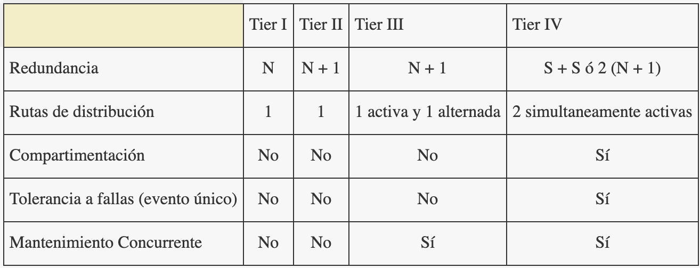

El diseño de centros de datos basados en clústeres de alto rendimiento, eficiencia energética y que sean confiables se ha convertido en un tema importante, más con el uso creciente de centros de datos en casi todos los sectores de nuestra sociedad: instituciones académicas, agencias gubernamentales y una gran cantidad de empresas comerciales. Empresas comerciales como Google, Amazon, Akamai, AOL y Microsoft utilizan de miles a millones de servidores en un entorno de centro de datos para manejar un gran volumen de tráfico para proporcionar un servicio personalizado (24x7).
En vista de este panorama, las investigaciones recientes se centran en el diseño de centros de datos basados en clústeres de múltiples niveles (multi-tier), la explotación de interconexiones de E/S de alta velocidad y la administración de energía para satisfacer las demandas actuales de los grandes centros de datos de rápido crecimiento.

# Definiendo los Tiers

El sistema de clasificación para los tiers implica varias definiciones. Un sitio que puede soportar al menos una falla de infraestructura no planificada, en el peor de los casos, sin impacto de carga crítica se considera tolerante a fallas. Un sitio que puede soportar al menos una falla de infraestructura no planificada, en el peor de los casos, sin impacto de carga crítica se considera tolerante a fallas. Un centro de datos típico está compuesto por al menos 20 sistemas mecánicos, eléctricos, de protección contra incendios, de seguridad y otros principales, cada uno de los cuales tiene subsistemas y componentes adicionales [@turner_industry_2005]. Todos estos deben ser mantenibles simultáneamente y/o tolerantes a fallas para que el sitio cumpla con el requisito de tolerancia a fallas y/o mantenible simultáneamente. 

Algunos sitios construidos con conceptos eléctricos S+S tolerantes a fallas no lograron incorporar la analogía mecánica, que involucra sistemas mecánicos duales. Dichos sitios están clasificados como Tier IV eléctricamente, pero solo alcanzan un Tier III mecánicamente. Otro error común es mirar solo las fallas de primer nivel y no las fallas posteriores que a veces se desencadenan por la primera falla.

# Normas y Funcionamiento de cada Tier

## Tier I: Infraestructura Básica del sitio

Requisito fundamental:

- Un centro de datos básico de Tier I tiene componentes de capacidad no redundantes y una ruta de distribución única no redundante que sirve al equipo informático.

Normas y Funcionamiento:

- El trabajo planificado requerirá que la mayoría o todos los sistemas de infraestructura del sitio se apaguen, lo que afectará a los equipos, sistemas y usuarios finales de los computadores.
- Una interrupción o falla no planificada de cualquier sistema de capacidad, componente de capacidad o elemento de distribución afectará el equipo informático.
- Hay capacidad suficiente para satisfacer las necesidades del sitio.
- La carga crítica en estos sistemas es de hasta el 100% de N.
- El sitio es susceptible a interrupciones tanto por actividades planificadas como no planificadas. Los errores de operación o fallas espontáneos de los componentes de la infraestructura del sitio causarán una interrupción del centro de datos.
- La infraestructura del sitio debe interrumpirse completamente una vez al año para realizar de manera segura el mantenimiento preventivo y el trabajo de reparación necesarios. Las situaciones urgentes pueden requerir interrupciones más frecuentes. La falta de mantenimiento regular aumenta significativamente el riesgo de interrupciones no planificadas, así como la gravedad de la falla consiguiente.

## Tier II: Infraestructura de Componentes de Capacidad Redundante del sitio

Requisito fundamental:

- Un centro de datos de Tier II tiene componentes de capacidad redundantes y una ruta de distribución única, no redundante, que sirve al equipo informático.

Normas y Funcionamiento:

- Los componentes de capacidad redundante pueden retirarse del servicio de forma planificada sin que se apague ningún equipo informático.
- Al remover las rutas de distribución del servicio para mantenimiento u otra actividad se requiere el apagado del equipo informático.
- Una interrupción o falla no planificada de cualquier sistema de capacidad o elemento de distribución afectará el equipo informático. Un fallo de un componente de capacidad no planificado puede afectar al equipo informático.
- El sitio es susceptible a interrupciones tanto de actividades planificadas como de eventos no planificados. Los errores de funcionamiento o las fallas espontáneas de los componentes de la infraestructura del sitio pueden causar una interrupción del centro de datos.
- La infraestructura del sitio debe cerrarse por completo una vez al año para realizar de manera segura el mantenimiento preventivo y el trabajo de reparación. Las situaciones urgentes pueden requerir interrupciones más frecuentes. La falta de mantenimiento regular aumenta significativamente el riesgo de interrupciones no planificadas, así como la gravedad de la falla consiguiente.

## Tier III: Infraestructura de Mantenimiento Concurrente del sitio

Requisito fundamental:

- Un centro de datos de mantenimiento concurrente o simúltaneo tiene componentes de capacidad redundantes y múltiples rutas de distribución independientes que sirven al equipo informático. Por lo general, solo una ruta de distribución sirve al equipo informático en cualquier momento.
- Todo el equipo de TI tiene doble alimentación y se instala correctamente para que sea compatible con la topología de la arquitectura del sitio.

Normas y Funcionamiento:

- Todos y cada uno de los componentes de capacidad y los elementos de las rutas de distribución pueden retirarse del servicio de forma planificada sin afectar a ninguno de los equipos informáticos.
- Una interrupción o falla no planificada de cualquier sistema de capacidad afectará al equipo informático.
- Una interrupción o falla no planificada de un componente de capacidad o elemento de distribución puede afectar el equipo informático.
- Hay suficiente capacidad instalada de forma permanente para satisfacer las necesidades del sitio cuando se retiran del servicio los componentes redundantes.
- El sitio es susceptible de sufrir interrupciones por actividades no planificadas. Los errores de funcionamiento o las fallas espontáneas de los componentes de la infraestructura del sitio pueden causar una interrupción de la computadora.
- El mantenimiento planificado de la infraestructura del sitio se puede realizar utilizando los componentes de capacidad redundantes y las rutas de distribución para trabajar de forma segura en el equipo restante.
- Para establecer la Mantenibilidad Concurrente del sistema de distribución de energía crítica entre la UPS y el equipo de computadora, los sitios de Tier III requieren que todo el hardware de la computadora tenga entradas de energía dual. Los dispositivos de transferencia, como los interruptores de punto de uso, deben incorporarse para equipos informáticos que no cumplan con esta especificación.
- Durante las actividades de mantenimiento, el riesgo de interrupción puede aumentar.

## Tier IV: Infraestructura de Tolerancia a Fallos del sitio

Requisito fundamental:

- Un centro de datos tolerante a fallas tiene múltiples sistemas independientes, físicamente aislados, cada uno de los cuales tiene componentes de capacidad redundantes y múltiples rutas de distribución activas, independientes, diversas y que sirven simultáneamente al equipo informático.
- Todo el equipo de TI tiene doble alimentación y se instala correctamente para que sea compatible con la topología de la arquitectura del sitio. 

Normas y Funcionamiento:

- Una sola falla de cualquier sistema de capacidad, componente de capacidad o elemento de distribución no afectará el equipo informático.
- El sistema en sí responde automáticamente (se autoregenera) a una falla para evitar un mayor impacto en el sitio.
- Todos y cada uno de los componentes de capacidad y los elementos de las rutas de distribución pueden retirarse del servicio de forma planificada sin afectar a ninguno de los equipos informáticos.
- Los sistemas complementarios y las rutas de distribución deben estar físicamente aislados entre sí (compartimentados) para evitar que cualquier evento individual impacte simultáneamente en ambos sistemas o rutas.
- Se requiere enfriamiento continuo.
- Hay capacidad suficiente para satisfacer las necesidades del sitio cuando los componentes redundantes o las rutas de distribución se han eliminado del servicio.
- El sitio no es susceptible a la interrupción de un solo evento no planificado.
- El sitio no es susceptible a la interrupción de ninguna actividad laboral planificada.
- El mantenimiento de la infraestructura del sitio se puede realizar utilizando los componentes de capacidad redundantes y las rutas de distribución para trabajar de manera segura en el equipo restante.
  - Durante las actividades de mantenimiento, el riesgo de interrupción puede aumentar.
  - Durante la actividad de mantenimiento en la que se cierra una ruta, el equipo informático está expuesto a un mayor riesgo de interrupción si se produce una falla en la ruta restante.
  - El funcionamiento de la alarma contra incendios, la supresión de incendios o la función de apagado de emergencia (Emergency Power Off, EPO) puede causar una interrupción del centro de datos.

La @fig:resumen-tiers incluye los requisitos para los estándares de rendimiento de cada tier y cómo se aplican por tier. 

{#fig:resumen-tiers}

# Conclusiones

Determinar la calificación de tier real de un sitio para el diseño de la topología no es un proceso complicado, aunque rara vez se realiza correctamente. En pocas palabras, la clasificación de topología de tiers para un sitio completo está limitada por la clasificación del subsistema más débil que afectará la operación del sitio [@turner_iv_tier_2006]. Los propietarios de los centros de datos tienen la responsabilidad de determinar qué nivel de funcionalidad es apropiado o requerido para sus sitios. Una vez seleccionado, el nivel deseado debe implementarse uniformemente en todos los sistemas.

# Referencias

---
nocite: '@*'
---
